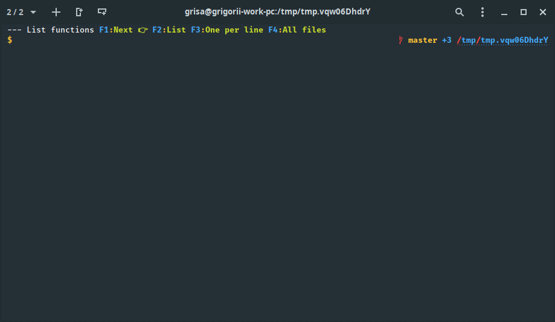

# f-shortcuts

Make shortcut toolbar for F1-F12 keys.



## Requirements

* zsh
* ruby 2.3.4 or later (only if for automatic generation of config)

## Installation

### If you use [oh-my-zsh](https://github.com/robbyrussell/oh-my-zsh)

* Clone this repository into `~/.oh-my-zsh/custom/plugins`
```sh
cd ~/.oh-my-zsh/custom/plugins
git clone https://github.com/zpm-zsh/f-shortcuts
```
* After that, add `f-shortcuts` to your oh-my-zsh plugins array.

### If you use [Zgen](https://github.com/tarjoilija/zgen)

1. Add `zgen load zpm-zsh/f-shortcuts` to your `.zshrc` with your other plugin
2. run `zgen save`

### If you use my [ZPM](https://github.com/zpm-zsh/zpm)

* Add `zpm load zpm-zsh/f-shortcuts` into your `.zshrc`

### Activation

Add `$pr_shortkeys` somethere in your `PROMPT` or `RPROMPT`

Start a new terminal session.

## Customization

### Automatic

You can define simple commands for FN keys in `~/.zsh-f-shortcuts.yaml` file. 

#### Structure

File should have two base keys:
1. `default_view` - default view to show.
2. `views` - list of defined views.

`views` section contains views you want to show. **Key is a view name.**

Under view name key you should define next keys:
1. `text` -  text that will show on touchbar key.
2. `command` or `view` - `command` means executing some command that under is this key and `view` means show view that is under this key

#### Example

```yml
default_view: "List functions"
views:
  "List functions":
    1:
      text: Next 👉
      view: "NPM functions"
    2:
      text: List
      command: ls
    3:
      text: One per line
      command: ll
    4:
      text: All files
      command: la
  "NPM functions":
    1:
      text: Next 👉
      view: "Git functions"
    2:
      text: NPM modules
      command: npm ls
  "Git functions":
    1:
      text: Next 👉
      view: "List functions"
    2:
      text: Git status
      command: git status
```
# TODO

- [ ] Change plugin name


## Contributing

If you have some proposals how to improve this boilerplate feel free to open issues and send pull requests!

1. Fork it
2. Create your feature branch (git checkout -b my-new-feature)
3. Commit your changes (git commit -am 'Add some feature')
4. Push to the branch (git push origin my-new-feature)
5. Create new Pull Request

## License

Available as open source under the terms of the [MIT License](https://opensource.org/licenses/MIT).
